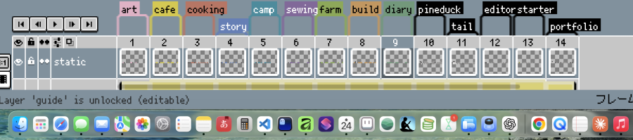
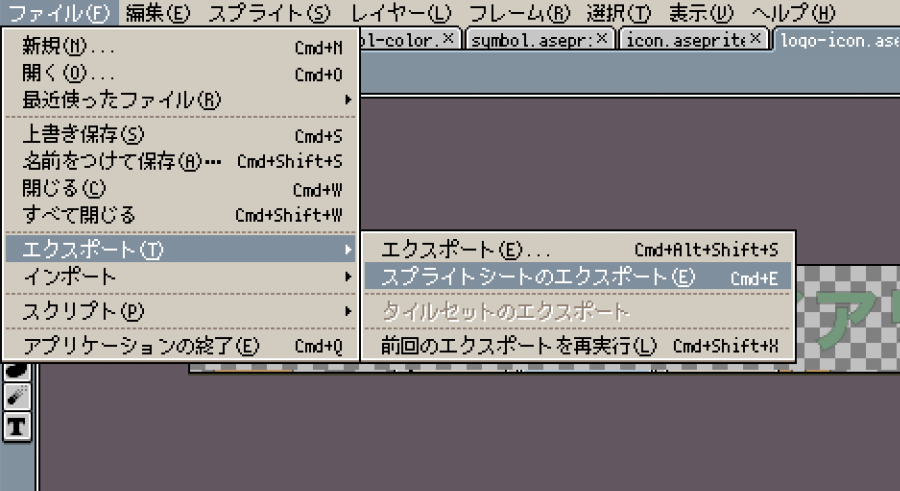
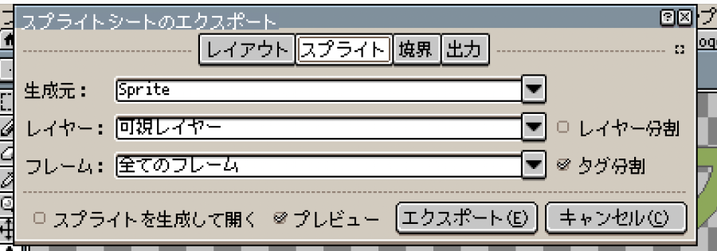
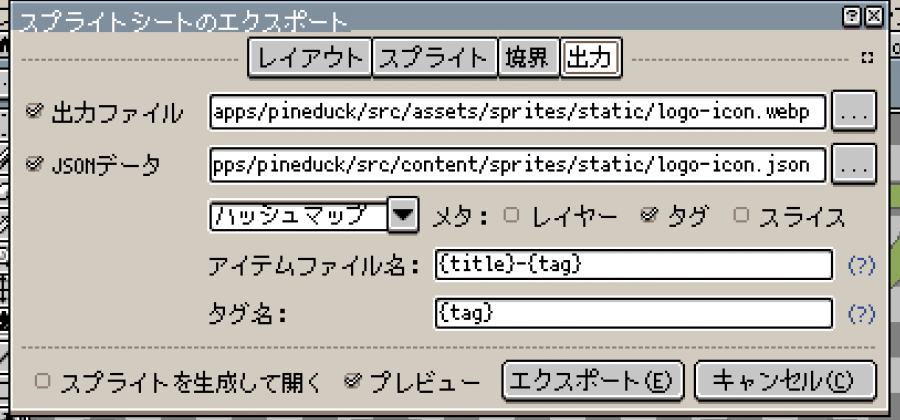
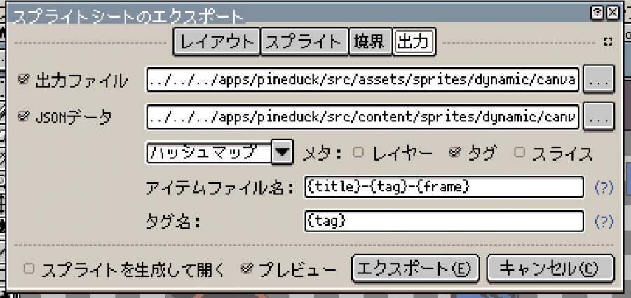

# スプライトの使用

Aseprite で作成したスプライトシートをコンポーネントで CSS に変換して使用することができます。

アニメーション付きのスプライトは、`DynamicSprite` コンポーネントを使用してください。アニメーションなしのスプライトは、`StaticSprite` コンポーネントを使用してください。

## 手順

### 1. Aseprite でスプライトシートを作成する

以下の項目を確認してください。

- 全てのフレームにタグが付いていること
- アニメーションはないこと



- **エクスポート > スプライトシートのエクスポート**を選択



- スプライト設定
  - 生成元: Sprite
  - タグ分割: ✔︎



- 出力設定 (`StaticSprite` の場合)
  - 出力ファイル: `/src/assets/sprites/static/*.webp`
  - JSONデータ:
    - フォーマット: ハッシュマップ
    - タグ: ✔︎
    - 出力ファイル: `/src/content/sprites/static/*.json`
    - アイテムファイル名: `{title}-{tag}`
    - タグ名: `{tag}`



- 出力設定 (`DynamicSprite` の場合)
  - 出力ファイル: `/src/assets/sprites/dynamic/*.webp`
  - JSONデータ:
    - フォーマット: ハッシュマップ
    - タグ: ✔︎
    - 出力ファイル: `/src/content/sprites/dynamic/*.json`
    - アイテムファイル名: `{title}-{tag}-{frame}`
    - タグ名: `{tag}`



### 2. コンポーネントでスプライトを使用する

#### 2.1. `StaticSprite` コンポーネントを使用する場合

Astro ファイルで以下のように記述します。

```astro
---
import StaticSprite from "@/components/StaticSprite.astro";
---

<StaticSprite
  name="logo-icon-download"
  width={100}
  height={100}
  alt="Logo Icon Download"
/>
```

属性は以下の通りです。

```typescript
interface Props {
  name: string; // 例: logo-icon-art (タグ名)
  width?: number;
  height?: number;
  alt?: string;
}
```

### 2.2. `DynamicSprite` コンポーネントを使用する場合

Astro ファイルで以下のように記述します。

```astro
---
import DynamicSprite from "@/components/DynamicSprite.astro";
---

<DynamicSprite name="canvas-home" alt="Canvas Home" />
```

属性は以下の通りです。

```typescript
interface Props {
  name: string; // 例: canvas-home (タグ名)
  alt?: string;
}
```
